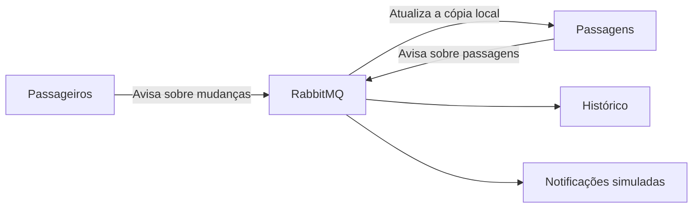

# Arquitetura orientada a eventos

## O que mudou

Antes, o serviço de passagens precisava consultar o serviço de passageiros por HTTP. Se passageiros parasse, operações de passagens também eram afetadas.

Agora, eles se comunicam por mensagens usando **RabbitMQ**. Uma mensagem avisa que algo aconteceu, como o cadastro de um passageiro ou a criação de uma passagem. Esse aviso é chamado de **evento**.

Passagens guarda uma cópia dos dados de passageiros e a atualiza ao receber os eventos. Assim, consegue usar os dados já sincronizados mesmo com o outro serviço desligado.

## Como funciona

Por exemplo, ao criar uma passagem:

1. O sistema verifica o passageiro e o assento.
2. Salva a passagem e o evento pendente no banco.
3. Responde ao cliente.
4. Envia o evento ao RabbitMQ.
5. Quem recebe a mensagem registra o histórico e uma notificação simulada, sem enviar e-mail.

O histórico e as notificações são partes do serviço de passagens.

## E se ocorrer uma falha?

- **RabbitMQ desligado:** o evento fica salvo no banco para envio posterior. Isso é chamado de *outbox*.
- **Mensagem repetida:** o sistema evita duplicar os registros.
- **Erro ao processar:** tenta até 3 vezes. Se não funcionar, coloca a mensagem em uma fila de erros, chamada *DLQ*.

## Padrões e ferramentas

- **Publish/subscribe:** o mesmo evento de criação alimenta histórico e notificações.
- **Topic:** o assunto da mensagem define para qual fila ela vai.
- **Fila de trabalho:** vários consumidores podem dividir as mensagens de uma fila.

O **Spring Boot** facilita essa integração: `RabbitTemplate` envia mensagens e `@RabbitListener` recebe. `@Transactional` salva a alteração e o evento juntos no banco.

## Vantagens e cuidados

**Vantagens:** menor dependência entre serviços, melhor distribuição do trabalho e possibilidade de processar mensagens depois de uma falha temporária.

**Cuidados:** o sistema fica mais complexo e os dados não se atualizam imediatamente. Um passageiro recém-cadastrado pode levar alguns instantes para ficar disponível em passagens. O histórico também pode aparecer depois.

Essa arquitetura é útil para reservas, notificações e sistemas com muitos pedidos. Para um cadastro simples ou que exige atualização imediata entre todos os serviços, ela pode não compensar.

Nesta demonstração, há apenas um RabbitMQ, sem alta disponibilidade.

