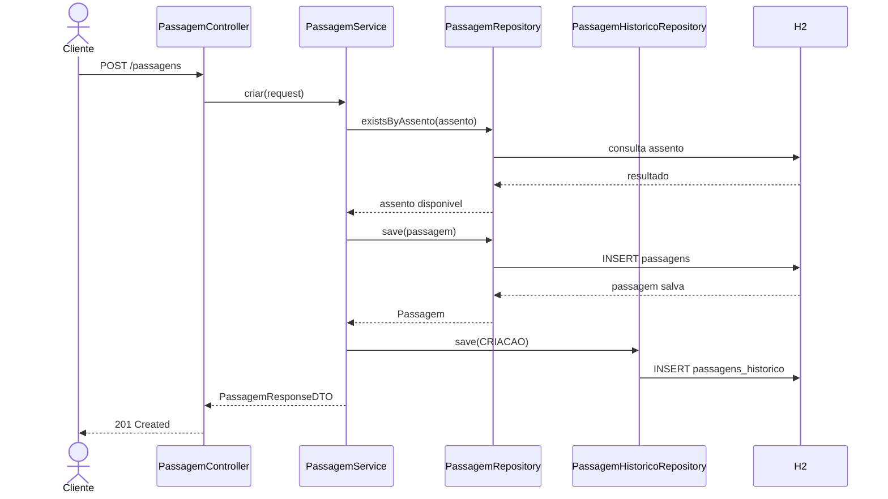
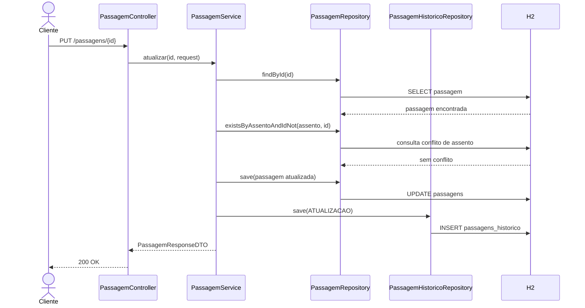

# Passagens

API REST para gerenciamento de passagens, desenvolvida com Spring Boot, Spring Data JPA e banco H2 em memoria. O projeto permite cadastrar, consultar, atualizar, remover e buscar passagens por destino, alem de manter um historico das alteracoes realizadas em cada passagem.

## Tecnologias

- Java 21
- Spring Boot
- Spring Web
- Spring Data JPA
- Spring Security
- H2 Database
- Maven
- Lombok

## Funcionalidades

- CRUD de passagens.
- Busca de passagens por destino.
- Validacao de assento unico.
- Persistencia real com JPA/Hibernate.
- Historico de criacao, atualizacao e remocao de passagens.
- Testes automatizados da camada de persistencia.

## Endpoints principais

| Metodo | Endpoint | Descricao |
|---|---|---|
| `GET` | `/passagens` | Lista todas as passagens |
| `POST` | `/passagens` | Cria uma nova passagem |
| `GET` | `/passagens/{id}` | Busca uma passagem por ID |
| `PUT` | `/passagens/{id}` | Atualiza uma passagem |
| `DELETE` | `/passagens/{id}` | Remove uma passagem |
| `GET` | `/passagens/busca?destino=...` | Busca passagens por destino |
| `GET` | `/passagens/{id}/historico` | Lista o historico de uma passagem |


## Sequencia: criar passagem



## Sequencia: atualizar passagem



## Como executar

```powershell
.\mvnw.cmd spring-boot:run
```

A aplicacao sobe em `http://localhost:8080`.

Console H2:

```text
http://localhost:8080/h2-console
```

Dados de conexao:

```text
JDBC URL: jdbc:h2:mem:passagensdb
User: sa
Password:
```

## Como testar

```powershell
$env:JAVA_HOME='C:\Program Files\Java\jdk-21'
.\mvnw.cmd test
```

Os testes validam o carregamento da aplicacao e o comportamento de persistencia com registro de historico.
